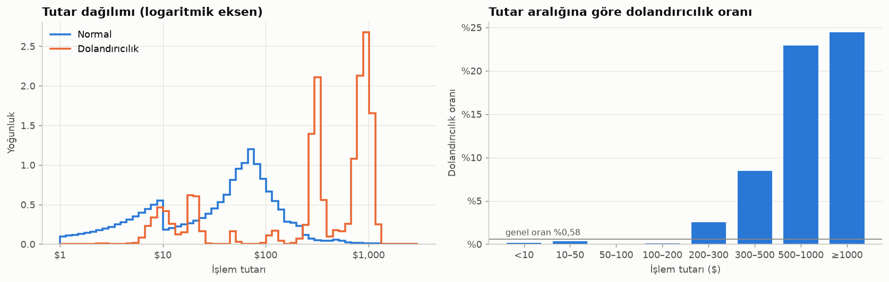
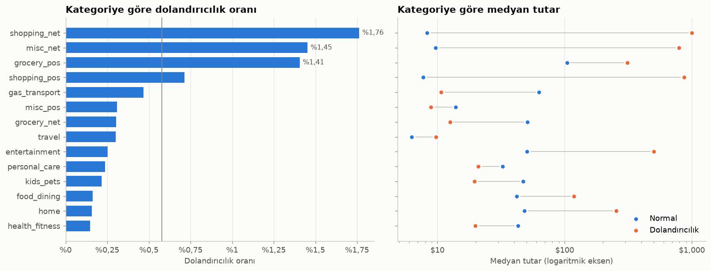
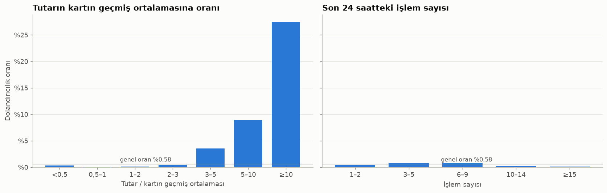
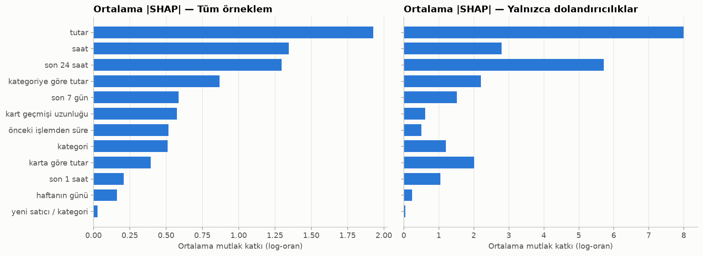

# 💳 Card Fraud Detection: Kart Dolandırıcılığı Tespit Sistemi

[](https://github.com/TolgaARSLANN/card-fraud-detection/actions/workflows/ci.yml)


Kart işlemlerini, **işlem anında bilinen bilgilerle** puanlayıp şüpheli olanları inceleme
kuyruğuna gönderen, uçtan uca bir makine öğrenmesi projesi. İşlemlerin yalnızca ~%0,5'i
dolandırıcılık olduğu için projenin odağında sınıf dengesizliği, PR-AUC, maliyet tabanlı eşik
seçimi ve açıklanabilirlik var.

> Durum: Veri, özellikler, modelleme, tek seferlik test değerlendirmesi, açıklanabilirlik,
> skorlama API'si ve izleme paneli tamamlandı. Sırada Docker ile paketleme var. Ayrıntılı plan
> ve her adımın kararları: [docs/YOL_HARITASI.md](docs/YOL_HARITASI.md)

## Veri
[Credit Card Transactions Fraud Detection](https://www.kaggle.com/datasets/kartik2112/fraud-detection)
(Sparkov simülatörü): ABD'de 999 kart ve 693 satıcı arasında, 2019-01-01 ile 2020-12-31
arasındaki 1.852.394 **sentetik** kart işlemi.

| bölme | dönem | işlem | dolandırıcılık oranı |
|---|---|---|---|
| Eğitim | 2019-01-01 → 2020-03-31 | 1.097.693 | %0,58 |
| Doğrulama | 2020-04-01 → 2020-06-21 | 198.982 | %0,58 |
| Test | 2020-06-21 → 2020-12-31 | 555.719 | %0,39 |

- **Bölme zamana göredir, rastgele değildir.** Dolandırıcılık her kartta ~2 günlük tek bir
  patlama hâlinde geliyor; rastgele bölme aynı patlamayı eğitim ve teste dağıtıp sonuçları
  şişirirdi. Test dönemi, veri setinin kendi `fraudTest` dosyasıyla birebir aynıdır.
- **Kalite:** Boş değer, tekrar eden işlem ve geçersiz değer yok. Kişisel veri sütunları (ad,
  soyad, adres, işlem no) modele girmeden önce atılır. Ayrıntılar:
  [veri kalite raporu](reports/veri_kalite_raporu.md)

## Veriden Öğrendiklerimiz
Tam analiz: [notebooks/01_eda.ipynb](notebooks/01_eda.ipynb). Analiz yalnızca eğitim
bölmesiyle yapıldı.

1. **Tutar en güçlü tekil sinyal.** Dolandırıcılığın medyan tutarı $395, normal işlemlerin $47.
   $500–1.000 aralığındaki işlemlerde dolandırıcılık oranı %22,9.
2. **Ama tutarın anlamı kategoriye göre tersine dönüyor.** Çevrim içi alışverişte dolandırıcılık
   normalin ~120 katı tutarında, akaryakıtta ise ~6 kat **küçük**. Bu yüzden tutar, kategorinin
   normuna göre de ölçülüyor.
3. **Dolandırıcılık gece yoğunlaşıyor.** 22:00–03:59 arası işlemlerin %23,5'i, dolandırıcılığın
   ise %84,7'si.
4. **Patlamayı işlem sayısı değil, tutar ele veriyor.** Son 24 saatteki işlem sayısının medyanı
   normal işlemlerde 3, dolandırıcılıkta 4; fark küçük. Buna karşılık tutarı kartın geçmiş ortalamasının 3 katını aşan işlemler,
   tüm işlemlerin %4'ü ama dolandırıcılığın %65'i.
5. **Bazı beklenen sinyaller bu veride yok.** Müşteri–satıcı mesafesi iki sınıfta aynı
   dağılıyor; simülatör satıcı konumunu rastgele üretiyor. Demografik sinyal zayıf ve yaş ile
   cinsiyet korunan özellikler olduğu için ana modelde kullanılmıyor.

<p align="center">
  <br>
  <em>Dolandırıcılık tutarları birkaç dar bantta toplanıyor; oran $200'ün üzerinde hızla artıyor.</em>
</p>

<p align="center">
  <br>
  <em>Solda: En riskli üç kategori, dolandırıcılığın %58'ini içeriyor. Sağda: Bazı kategorilerde dolandırıcılık normalden çok büyük, bazılarında küçük.</em>
</p>

<p align="center">
  <br>
  <em>Tutarın kartın geçmiş ortalamasına oranı güçlü bir sinyal (solda); işlem sayısı ise neredeyse hiç ayırt etmiyor (sağda).</em>
</p>

## Yaklaşım
- **Özellikler yalnızca geçmişten:** Her işlem için kartın o ana kadarki geçmişi kullanılır
  (son 1 saat / 24 saat / 7 gündeki işlem sayısı ve tutarı, kartın ve kategorinin normuna göre
  tutar, önceki işlemden geçen süre, yeni satıcı / kategori). Bir test, gelecekteki satırlar
  değiştirildiğinde hiçbir özelliğin değişmediğini doğrular.
- **Model:** LightGBM, normal işlemlerden alt örnekleme ile eğitildi. Doğrulama döneminde
  LightGBM ve XGBoost; dengesizlik stratejisi olarak hiçbiri, sınıf ağırlığı, alt örnekleme
  ve SMOTE karşılaştırıldı (referanslar: kural, lojistik regresyon, Isolation Forest). Optuna ile yapılan ayar, önceden
  yazılan kurala göre kazanç sağlamadığı için reddedildi.
- **Olasılık ve karar:** Alt örnekleme skoru şişirdiği için önsel düzeltme ile kalibre edilir.
  Alarm kuralı beklenen maliyettir: olasılık × tutar ≥ $10 inceleme ücreti ise incele.
- **Adalet:** Yaş ve cinsiyet modele girmez; cinsiyete göre hata oranları ayrıca izlenir.
- **Açıklama:** Her alarm için SHAP katkıları 12 anlam grubunda toplanır ve ilk 3 neden Türkçe
  cümleyle verilir (ör. "Tutar, kartın geçmiş ortalamasının … katı").

## Sonuçlar (test dönemi, bir kez değerlendirildi)
Test dönemine yalnızca bir kez, protokol önceden yazılıp commit'lendikten sonra bakıldı.
Tam rapor: [reports/test_sonuclari.md](reports/test_sonuclari.md)

| model | PR-AUC | ROC-AUC | günde 25 alarmla yakalanan |
|---|---|---|---|
| **LightGBM · alt örnekleme** | **0,959** | 0,999 | %93,9 |
| Lojistik regresyon | 0,534 | 0,983 | %70,6 |
| Yalnızca tutar | 0,137 | 0,833 | %45,7 |

- PR-AUC farkı (model − lojistik regresyon): **0,425**, %95 güven aralığı [0,386; 0,467]
  (kart düzeyinde bootstrap). Önceden belirlenen başarı ölçütü geçildi.
- Karar kuralıyla 6 ayda 2.522 alarm: dolandırıcılığın %87'si, dolandırıcılık tutarının
  %98'i yakalandı; precision %74. Toplam maliyet **$45.525**. Hiç alarm vermemenin maliyeti
  $1.133.325 olurdu.
- Dolandırıcılık patlamalarının %99,5'inde en az bir alarm var; %74'ü patlamanın ilk
  işleminde yakalandı.

<p align="center">
  <br>
  <em>Model en çok tutara dayanıyor; ardından saat ve son 24 saatteki harcama geliyor.</em>
</p>

## Servis ve Panel
- **API (FastAPI):** `POST /score` işlemi skorlar ve olasılık, beklenen kayıp, karar, risk
  seviyesi ile ilk 3 nedeni döndürür. API, kart geçmişini bellekte tutar ve özellikleri
  eğitimdeki aynı kodla hesaplar. 2.000 gerçek test işleminde eğitimdeki özelliklerle farkın
  sıfır olduğu doğrulandı (`make consistency`).
- **Panel (Streamlit, "Gece Nöbeti"):** Canlı akış (test dönemi işlemleri sırayla skorlanır,
  alarm kuyruğu oluşur), İşlem incele (bir işlemin kararı ve nedenleri), Eşik ve maliyet
  (inceleme ücreti değişirse alarm sayısı ve maliyet nasıl değişir).

## Kurulum ve Çalıştırma
Linux, macOS veya WSL üzerinde:
```bash
python3 -m venv .venv && source .venv/bin/activate
make install    # pip install -e ".[dev,ml,api,ui]"
make data       # veriyi indirir (Kaggle): data/raw/{train,test}.parquet
make process    # temizlik ve bölme: data/processed/transactions.parquet
make features   # geçmişe dayalı özellikler
make threshold  # final modeli eğitir, kalibre eder, karar kuralını kaydeder: models/
make panel-data # panelin "Eşik ve maliyet" sekmesi için skorlar
make ui         # API'yi (gerekirse) başlatır ve paneli açar: http://localhost:8501
```
Diğer adımlar (`quality`, `eda`, `baselines`, `train`, `tune`, `errors`, `explain`) ara
raporları yeniden üretir. `make final` testi değerlendirir. Bu adım protokol gereği yalnızca
bir kez çalışır, sonraki çalıştırmaları reddeder. `make test` ve `make lint` ile testler
ve kod denetimi çalışır.

Yalnızca API ya da yalnızca panel için daha küçük kurulumlar yeterlidir:
`pip install ".[api]"` / `pip install ".[ui]"`. Paket düzenlenebilir olmayan biçimde
kurulduğunda komutlar proje kökünden çalıştırılmalı ya da `CARD_FRAUD_ROOT` verilmelidir.

## Demo modu (herkese açık yayın için)
`DEMO_MODE=1` ortam değişkeniyle açılır; varsayılan kapalıdır ve kapalıyken yukarıdaki yerel
davranış aynen sürer.
```bash
DEMO_MODE=1 streamlit run src/card_fraud_detection/ui/app.py
```
- **Panel:** API'ye gitmeden aynı süreçte skorlar. Model ve yüklenmiş kart geçmişi tüm
  ziyaretçiler için tek kopyadır. Her oturum yalnızca kendi eklediği işlemleri ayrı bir
  katmanda tutar, bu yüzden ziyaretçiler birbirini etkilemez. Oturum başına 2.000 akış
  işlemi sınırı vardır. Bellekte en fazla 50 oturum tutulur; 30 dakika işlem yapmayan
  oturum silinir. Kart numarası serbestçe girilemez; maskeli etiketli sentetik kartlardan
  seçilir. Başlangıç anı üç sabit seçenekle sınırlıdır. Üstte "veriler sentetiktir,
  gerçek kart ya da kişisel bilgi girmeyin" notu sürekli görünür ve hata ayrıntıları
  gösterilmez.
- **API** (`DEMO_MODE=1 uvicorn ...`):
  - `/reset` hiç tanımlanmaz.
  - `/score` geçmişe kayıt yapmaz ve yalnızca veri setindeki kartları kabul eder.
  - IP başına dakikada 60 istek sınırı vardır (aşılınca 429). İstemci IP'si
    `X-Forwarded-For`'un güvenilen vekil tarafındaki değerinden alınır (`TRUSTED_PROXY_HOPS`,
    varsayılan 1).
  - İstek gövdesi en fazla 10 KB olabilir (aşılınca 413).
  - Loglarda kart numaraları maskelenir; beklenmeyen hatalarda iç ayrıntı dönmez.
- **Demo verisi** yalnızca şu sütunları içerir: `tx_id`, `trans_date_trans_time`,
  `cc_num`, `amt`, `category`, `merchant`, `is_fraud`, `split` (`data/demo.py`). Ad, adres,
  doğum tarihi, cinsiyet, meslek, konum ve işlem no gibi sütunlar hiç girmez; bunu bir test
  denetler.
- **Lisans:** Veri seti Kaggle'da **CC0: Public Domain** lisanslıdır
  ([kartik2112/fraud-detection](https://www.kaggle.com/datasets/kartik2112/fraud-detection),
  Kaggle API'sinden 2026-10-07'de doğrulandı). Veriyi üreten Sparkov simülatörü
  ([namebrandon/Sparkov_Data_Generation](https://github.com/namebrandon/Sparkov_Data_Generation))
  MIT lisanslıdır. Yeniden dağıtım serbesttir; kaynağı belirtmek yine de iyi bir uygulamadır.

## Sınırlamalar
- **Sentetik veri.** Bulgular Sparkov simülatörünün davranışını yansıtır. Örneğin
  dolandırıcılıkta en yüksek tutar $1.372'dir; model "bu tutarın üzerinde dolandırıcılık yok"
  gibi gerçek dünyada karşılığı olmayan kurallar öğrenebilir.
- **Soğuk başlangıç yok.** Test kartlarının %98'i eğitimde de görülüyor; yeni açılmış kartlardaki
  performans bu veriyle ölçülemiyor.
- **Etiket gecikmesi yok sayıldı.** Gerçekte dolandırıcılık etiketi haftalar sonra gelir. Bu
  yüzden model geçmiş etiketleri özellik olarak kullanmaz; yeniden eğitim döngüsü ise
  kurulmadı.
- **Kavram kayması sınırlı ölçüldü.** Test dönemi altı ay. Aylık PR-AUC 0,929 ile 0,971
  arasında. En zayıf ay Aralık: işlem hacmi iki katına çıkarken precision %60'a düşüyor
  (diğer aylarda %72-80). Model izlenmeli ve yeniden eğitilmeli.
- **Servis tek süreçlidir.** Kart geçmişi bellekte tutulur, API yeniden başlarsa geçmiş başa
  döner (panel bunu fark edip eşitlemeyi önerir). Gerçek bir sistemde geçmiş paylaşılan bir
  depoda (ör. Redis) tutulmalıdır. Panel tek kullanıcılı bir demodur.
