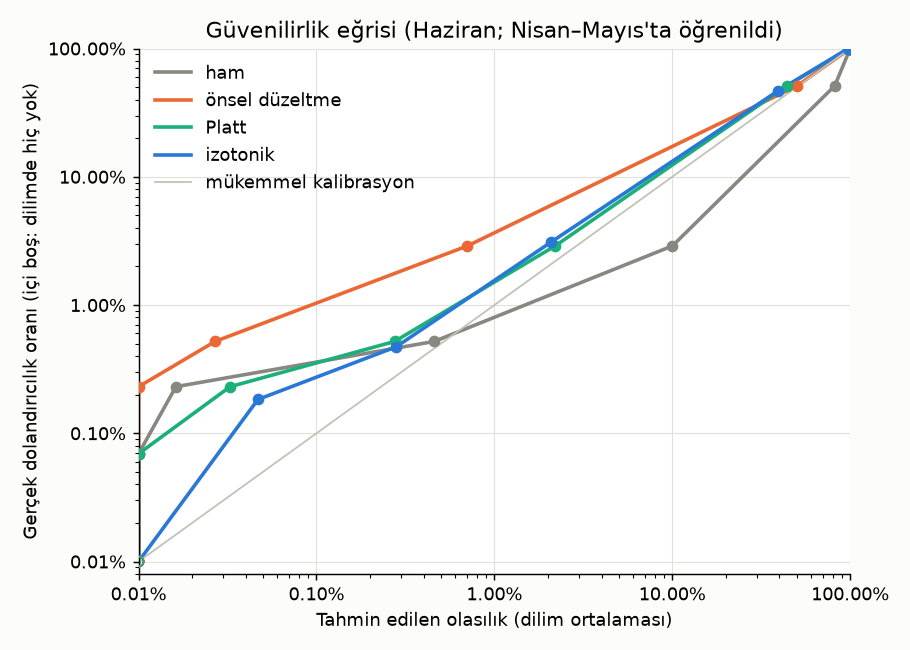

# Kalibrasyon ve Karar Kuralı (Faz 3.3)

_Üreten: `python -m card_fraud_detection.models.threshold` · Model: LightGBM · alt örnekleme, yalnızca eğitim bölmesiyle · Ölçüm: doğrulama bölmesi, genişleyen zaman penceresi (her ay, önceki aylarla öğrenilip o ayda ölçülür)_

## Karar: **beklenen maliyet** (önsel düzeltme kalibrasyon)

Seçim ölçütü (önceden konuldu): öğrenilmeyen aylardaki toplam maliyet. `sabit eşik, ölçülen ayda seçilmiş (tavan)` satırı yalnızca karşılaştırma içindir (iyimser tavan).

## Karar kuralları (öğrenilmeyen aylar toplamı)

| kural · kalibrasyon | alarm | kacan_tutar | maliyet |
|---|---|---|---|
| beklenen maliyet · önsel düzeltme | 932 | 3832 | 13152 |
| sabit eşik, ölçülen ayda seçilmiş (tavan) · — | 1054 | 2726 | 13266 |
| beklenen maliyet · Platt | 991 | 3675 | 13585 |
| beklenen maliyet · izotonik | 1052 | 3304 | 13824 |
| sabit eşik · izotonik | 1028 | 3744 | 14024 |
| beklenen maliyet · ham | 1162 | 2429 | 14049 |
| günlük bütçe · izotonik | 1300 | 19963 | 32963 |

## Kalibrasyon kalitesi (öğrenilmeyen ayda)

Brier ve log kaybı: düşük daha iyi. ECE: tahmin edilen ile gerçek oran arasındaki ortalama fark (eşit sayılı 10 dilim).

| ay · yöntem | Brier | log kaybı | ECE | ortalama olasılık | gerçek oran |
|---|---|---|---|---|---|
| 2020-05 · ham | 0.00113 | 0.00470 | 0.00137 | 0.00846 | 0.00709 |
| 2020-05 · önsel düzeltme | 0.00064 | 0.00269 | 0.00015 | 0.00724 | 0.00709 |
| 2020-05 · Platt | 0.00061 | 0.00230 | 0.00007 | 0.00705 | 0.00709 |
| 2020-05 · izotonik | 0.00063 | 0.00235 | 0.00003 | 0.00706 | 0.00709 |
| 2020-06 · ham | 0.00111 | 0.00474 | 0.00103 | 0.00682 | 0.00578 |
| 2020-06 · önsel düzeltme | 0.00075 | 0.00378 | 0.00024 | 0.00554 | 0.00578 |
| 2020-06 · Platt | 0.00073 | 0.00319 | 0.00040 | 0.00541 | 0.00578 |
| 2020-06 · izotonik | 0.00076 | 0.00339 | 0.00038 | 0.00540 | 0.00578 |

## Karar kuralları (ay ay)

| kural · kalibrasyon · ay | alarm | precision | recall | tutar_recall | kacan_tutar | maliyet | patlama_recall | ilk_islemde_yakalanan |
|---|---|---|---|---|---|---|---|---|
| beklenen maliyet · Platt · 2020-05 | 594 | 0.783 | 0.882 | 0.995 | 1431 | 7371 | 1.000 | 0.796 |
| beklenen maliyet · Platt · 2020-06 | 397 | 0.741 | 0.880 | 0.988 | 2244 | 6214 | 0.972 | 0.778 |
| beklenen maliyet · ham · 2020-05 | 691 | 0.690 | 0.905 | 0.998 | 608 | 7518 | 1.000 | 0.907 |
| beklenen maliyet · ham · 2020-06 | 471 | 0.660 | 0.931 | 0.990 | 1820 | 6530 | 1.000 | 0.861 |
| beklenen maliyet · izotonik · 2020-05 | 639 | 0.732 | 0.888 | 0.997 | 754 | 7144 | 1.000 | 0.833 |
| beklenen maliyet · izotonik · 2020-06 | 413 | 0.709 | 0.877 | 0.986 | 2550 | 6680 | 0.972 | 0.778 |
| beklenen maliyet · önsel düzeltme · 2020-05 | 571 | 0.828 | 0.898 | 0.995 | 1320 | 7030 | 1.000 | 0.870 |
| beklenen maliyet · önsel düzeltme · 2020-06 | 361 | 0.817 | 0.883 | 0.986 | 2512 | 6122 | 0.972 | 0.806 |
| günlük bütçe · izotonik · 2020-05 | 775 | 0.641 | 0.943 | 0.971 | 8196 | 15946 | 1.000 | 0.833 |
| günlük bütçe · izotonik · 2020-06 | 525 | 0.549 | 0.862 | 0.935 | 11766 | 17016 | 0.972 | 0.778 |
| sabit eşik · izotonik · 2020-05 | 612 | 0.846 | 0.983 | 0.994 | 1624 | 7744 | 1.000 | 0.963 |
| sabit eşik · izotonik · 2020-06 | 416 | 0.769 | 0.958 | 0.988 | 2120 | 6280 | 1.000 | 0.889 |
| sabit eşik, ölçülen ayda seçilmiş (tavan) · — · 2020-05 | 626 | 0.829 | 0.985 | 0.997 | 913 | 7173 | 1.000 | 0.981 |
| sabit eşik, ölçülen ayda seçilmiş (tavan) · — · 2020-06 | 428 | 0.750 | 0.961 | 0.990 | 1814 | 6094 | 1.000 | 0.889 |

